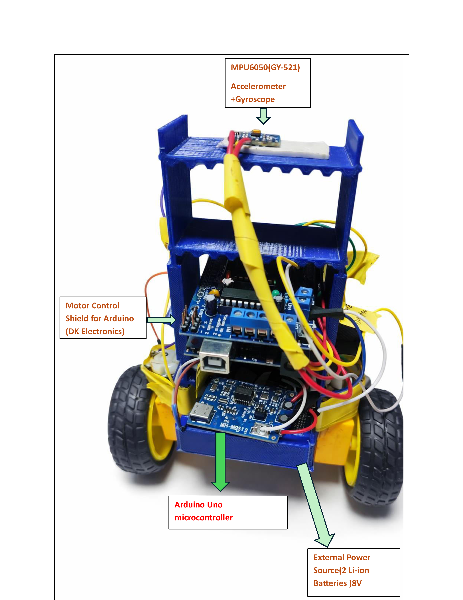
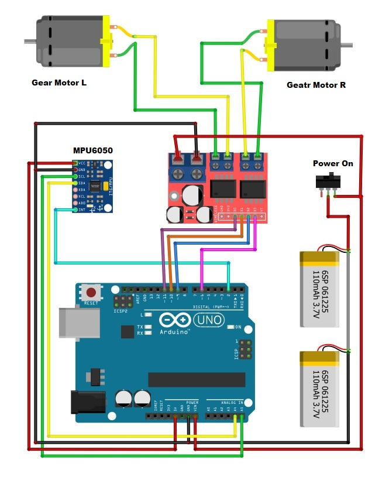
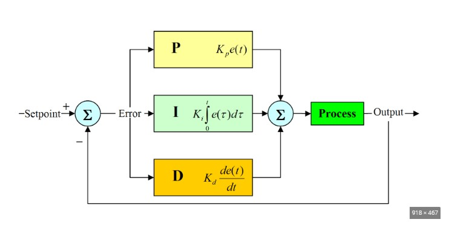
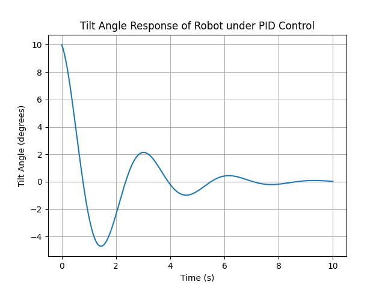

# PID-Based Self Balancing Robot

---

## Abstract
This project presents the design and implementation of a two-wheel self-balancing robot using real-time PID control. Tilt angle measurements obtained from the MPU6050 inertial sensor are processed by an Arduino microcontroller to generate corrective motor actions. The system demonstrates disturbance rejection and stable upright motion, illustrating the practical application of classical control theory in embedded robotic systems.

---

## Overview
A self-balancing robot operates on the principle of an inverted pendulum system. The robot continuously measures its tilt angle and adjusts motor speed to maintain vertical stability.

This project focuses on:
- Real-time angle measurement using MPU6050
- PID control algorithm implementation
- Motor driver based corrective actuation
- Experimental response analysis

---

## Hardware Components
- Arduino UNO
- MPU6050 (Gyroscope + Accelerometer)
- L298N Motor Driver
- DC Gear Motors
- Li-ion Battery Pack
- Chassis & Wheels

---

## Software & Tools
- Arduino IDE
- Embedded C
- PID Control Algorithm
- Serial Monitor for debugging

---

## Working Principle

1. MPU6050 measures tilt angle.
2. Arduino calculates error from vertical position.
3. PID controller computes correction:
   
   Output = Kp × e + Ki × ∫e dt + Kd × de/dt

4. Motor driver adjusts wheel speed.
5. Continuous feedback loop maintains balance.

---

## Project Demonstration

### Robot Prototype

### Block Diagram

### PID Control Block

### System Response Graph

---

## Results
- Achieved stable upright balancing
- Fast disturbance recovery
- Tuned PID parameters for optimal response
- Demonstrated real-time control implementation

---

## Applications
- Robotics research
- Control systems education
- Autonomous systems development
- Embedded systems training

---

## Future Improvements
- Kalman filter for improved angle estimation
- Bluetooth/WiFi remote monitoring
- Adaptive PID tuning
- Integration with ROS

---

## Author
Ayush Kumar Samal  
B.Sc Physics | Electronics & Control Systems Enthusiast  

---

## License
This project is open-source and available for educational and research purposes.
